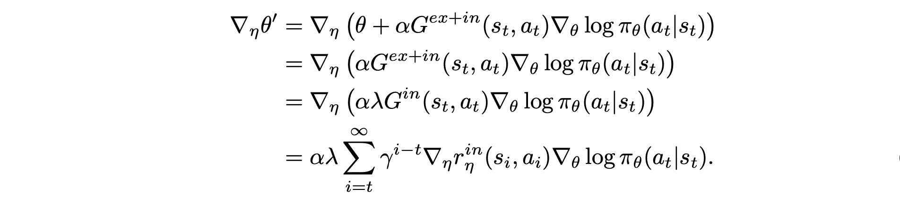
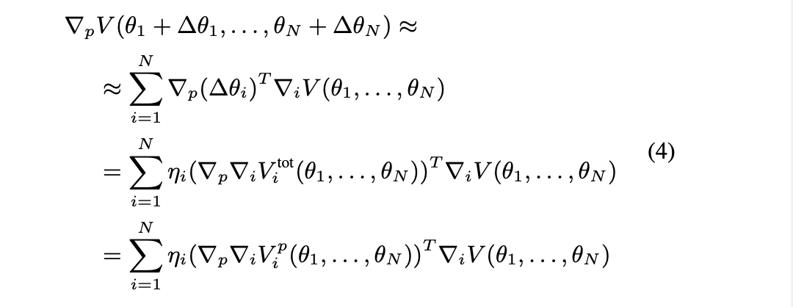

# Multi-Agent-RL
Paper list of multi-agent reinforcement learning (MARL)

- [Multi-Agent-RL](#multi-agent-rl)
  - [Credit Assignment Problem in MARL](#credit-assignment-problem-in-marl)
    - [Explicit assignment](#explicit-assignment)
      - [Reward Assignment](#reward-assignment)
        - [Distributed Welfare Games](#distributed-welfare-games)
        - [Difference Rewards Policy Gradients](#difference-rewards-policy-gradients)
        - [Social Influence as Intrinsic Motivation](#social-influence-as-intrinsic-motivation)
        - [Incentivizing Collaboration in a Competition](#incentivizing-collaboration-in-a-competition)
        - [Social Diversity and Social Preferences in Mixed-Motive Reinforcement Learning](#social-diversity-and-social-preferences-in-mixed-motive-reinforcement-learning)
        - [Inducing Cooperation through Reward Reshaping based on Peer Evaluations](#inducing-cooperation-through-reward-reshaping-based-on-peer-evaluations)
        - [Gifting in Multi-Agent Reinforcement Learning](#gifting-in-multi-agent-reinforcement-learning)
        - [Cooperation and Reputation Dynamics with Reinforcement Learning](#cooperation-and-reputation-dynamics-with-reinforcement-learning)
      - [Value Assignment](#value-assignment)
        - [MADDPG: Multi-Agent Actor-Critic for Mixed Cooperative-Competitive Environments](#maddpg-multi-agent-actor-critic-for-mixed-cooperative-competitive-environments)
        - [COMA: Counterfactual Multi-Agent Policy Gradients](#coma-counterfactual-multi-agent-policy-gradients)
        - [Shapley Q-value: Shapley Q-value: A Local Reward Approach to Solve Global Reward Games](#shapley-q-value-shapley-q-value-a-local-reward-approach-to-solve-global-reward-games)
        - [CPGs: Causal Policy Gradients](#cpgs-causal-policy-gradients)
    - [Learning assignment](#learning-assignment)
      - [Value Decomposition](#value-decomposition)
        - [VDN: Value-Decomposition Networks For Cooperative Multi-Agent Learning](#vdn-value-decomposition-networks-for-cooperative-multi-agent-learning)
        - [QMIX: Monotonic Value Function Factorisation for Deep Multi-Agent Reinforcement Learning](#qmix-monotonic-value-function-factorisation-for-deep-multi-agent-reinforcement-learning)
        - [DOP: Off-Policy Multi-Agent Decomposed Policy Gradients](#dop-off-policy-multi-agent-decomposed-policy-gradients)
        - [LICA: Learning Implicit Credit Assignment for Cooperative Multi-Agent Reinforcement Learning](#lica-learning-implicit-credit-assignment-for-cooperative-multi-agent-reinforcement-learning)
        - [CollaQ: Multi-agent Collaboration via Reward Attribution Decomposition](#collaq-multi-agent-collaboration-via-reward-attribution-decomposition)
      - [Reward shaping](#reward-shaping)
        - [On Learning Intrinsic Rewards for Policy Gradient Methods](#on-learning-intrinsic-rewards-for-policy-gradient-methods)
        - [LIIR: Learning Individual Intrinsic Reward in Multi-Agent Reinforcement Learning](#liir-learning-individual-intrinsic-reward-in-multi-agent-reinforcement-learning)
        - [Adaptive Mechanism Design: Learning to Promote Cooperation](#adaptive-mechanism-design-learning-to-promote-cooperation)
        - [Learning to Incentivize Other Learning Agents](#learning-to-incentivize-other-learning-agents)
        - [Learning to Share in Multi-Agent Reinforcement Learning](#learning-to-share-in-multi-agent-reinforcement-learning)
        - [Coordinating the Crowd: Inducing Desirable Equilibria in Non-Cooperative Systems](#coordinating-the-crowd-inducing-desirable-equilibria-in-non-cooperative-systems)
        - [D3C: Reducing the Price of Anarchy in Multi-Agent Learning](#d3c-reducing-the-price-of-anarchy-in-multi-agent-learning)
  - [Information Sharing in MARL](#information-sharing-in-marl)
    - [State Aggregation](#state-aggregation)
    - [State & Action Aggregation](#state--action-aggregation)
  - [Planning in MARL](#planning-in-marl)
    - [Explicit planning](#explicit-planning)
    - [Implicit planning](#implicit-planning)
  - [Hierarchical Reinforcement Learning](#hierarchical-reinforcement-learning)
    - [Goal-conditioned HRL](#goal-conditioned-hrl)
      - [HAM](#ham)
      - [UVFA](#uvfa)
      - [FuN](#fun)
      - [h-DQN](#h-dqn)
      - [HER](#her)
      - [HIRO](#hiro)
      - [Language as an Abstraction](#language-as-an-abstraction)

## Credit Assignment Problem in MARL
In the cooperative MARL setting, either global reward or individual reward is coupled with other agents. The Credit Assignment Problem is to assign proper reward or value to agents, so agents can make cooperative decisions individually.
1. Difference reward
   1. [Optimal Payoff Functions for Members of Collectives. 2001](http://www.eecs.harvard.edu/cs286r/courses/spring06/papers/wolptumer_optimalPay01.pdf)
      1. Aristocrat Utility:
         1. marginal contribution of agent (coalition)
      2. Wonderful Life Utility: 
         1. counterfactual baseline

### Explicit assignment
Explicitly calculate the contribution of single agent

#### Reward Assignment
Global reward -> (explicit calculation) -> local reward 
##### Distributed Welfare Games
   1. rules of assignment
      1. Budget balance
      2. Informational dependencies
      3. Induced nash equilibrium
   2. assignments
      1. Equally Shared
      2. Marginal Contribution
      3. Shapley Value
      4. The Weighted Shapley Value
##### Difference Rewards Policy Gradients
   1. global reward setting
      1. counterfactual reward
      2. difference return

##### Social Influence as Intrinsic Motivation
   1. individual reward design

      1. extrinsic reward
      2. social influence
         1. measure the cause influence between two agents
         2. KL divergence of policy of one agent with/o anther agent

##### Incentivizing Collaboration in a Competition
   1. individual reward design (local social welfare)

      1. this utility induce NE that maximize social welfare.
         1. potential function is the global social welfare

##### Social Diversity and Social Preferences in Mixed-Motive Reinforcement Learning
   1. individual reward design
      1. consider willingness of cooperation
      2. social value orientation

##### Inducing Cooperation through Reward Reshaping based on Peer Evaluations
   1. individual reward design
      1. peer Evaluation: a quantification of the effect of the joint actions on agent 𝑘’s expected reward 
      2. evaluation form others
      3. final reward

##### Gifting in Multi-Agent Reinforcement Learning
   1. individual reward design
      1. zero-sum: give by accumulated reward
      2. fixed budget: given fixed at the start 
      3. Replenishable Budget: accumulated, proportional to received reward

##### Cooperation and Reputation Dynamics with Reinforcement Learning
   1. individual reward design
   
      1. 𝑈 is their payoff in a particular encounter,
      2. 𝑆 refers to the payoff they would get facing themselves

#### Value Assignment
Global Q value -> (explicit calculation) -> local Q value
##### MADDPG: Multi-Agent Actor-Critic for Mixed Cooperative-Competitive Environments
   1. use global Q value
##### COMA: Counterfactual Multi-Agent Policy Gradients
   1. minus a counterfactual baseline
   2. COMA:
##### Shapley Q-value: Shapley Q-value: A Local Reward Approach to Solve Global Reward Games
   1. use shapley value to calculate assignment

##### CPGs: Causal Policy Gradients
   1. Multi-objective MDP
      1. consider causal graph between actions and objectives
      2. causal baseline

### Learning assignment

#### Value Decomposition
Global Q value -> (learning decomposition) -> Local Q value
IGM: individual-global-maximization

##### VDN: Value-Decomposition Networks For Cooperative Multi-Agent Learning
   1. Value decomposition:

##### QMIX: Monotonic Value Function Factorisation for Deep Multi-Agent Reinforcement Learning
   1. Value decomposition:

##### DOP: Off-Policy Multi-Agent Decomposed Policy Gradients
   1. Value decomposition + policy gradient

##### LICA: Learning Implicit Credit Assignment for Cooperative Multi-Agent Reinforcement Learning
   1. Value decomposition + policy gradient

##### CollaQ: Multi-agent Collaboration via Reward Attribution Decomposition
   1. learning value decomposition by taylor approximation of optimal reward

   2. approximate two terms directly

#### Reward shaping
Shaping individual reward -> maximize real env-reward
Learning shaping strategy through optimization (bi-level, black-box, evolutionary,...)
##### On Learning Intrinsic Rewards for Policy Gradient Methods
   1. optimal reward
      1. reward function maximizing extrinsic environment reward
   2. Gradient-based learning
      1. use total reward to update policy parameters:

      1. update Intrinsic reward use updated policy parameters 
    
         1. extrinsic reward policy gradient
         2. chain rules + approximating second terms

##### LIIR: Learning Individual Intrinsic Reward in Multi-Agent Reinforcement Learning
   1. adopt intrinsic reward in multi-agent setting (global env reward)
      1. maximize total env reward through individual intrinsic reward-based policy
   2. Gradient
      1. update policy using prox reward (in + ex)
      2. update intrinsic reward
         1. first term
         2. second term
##### Adaptive Mechanism Design: Learning to Promote Cooperation
   1. similar as LIIR

##### Learning to Incentivize Other Learning Agents
   1. intrinsic reward comes from other agents (has individual env reward)
      1. not budget balance

   2. gradient
      1. update individual policy

      2. update intrinsic (incentive) reward:
         1. maximize individual env reward: (not budget balance)
   
         1. the same as LIIR

##### Learning to Share in Multi-Agent Reinforcement Learning
   1. intrinsic reward comes from other agents (has individual env reward)
      1. generate proportion of assignment reward $w_{ji}$
      2.  budget balance
   2. gradient
      1. bi-level learning
         1. update policy based on assigned reward
         2. update weight generator

##### Coordinating the Crowd: Inducing Desirable Equilibria in Non-Cooperative Systems
   1. intrinsic reward

      1. treat agent learning process with intrinsic reward as black-box
      2. use bayesian optimization to optimize intrinsic reward
          
         1. different with LIIR, with penalty terms

##### D3C: Reducing the Price of Anarchy in Multi-Agent Learning
   1. intrinsic reward

      1. f': linear combination of reward from other agents
      2. minimize the divergence of assignment matrix
   1. objective
      1. Local Price of Anarchy
      2. approximating its upper bound

## Information Sharing in MARL

### State Aggregation
### State & Action Aggregation

## Planning in MARL

### Explicit planning

### Implicit planning

## Hierarchical Reinforcement Learning
### Goal-conditioned HRL
#### HAM
#### UVFA
#### FuN
#### h-DQN
#### HER
#### HIRO
#### Language as an Abstraction
