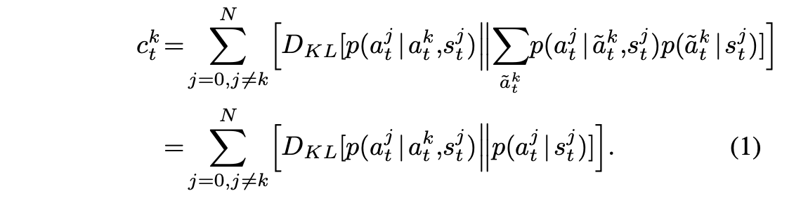
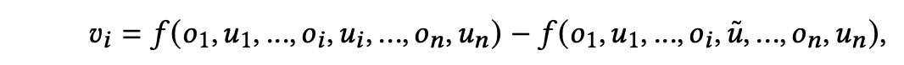
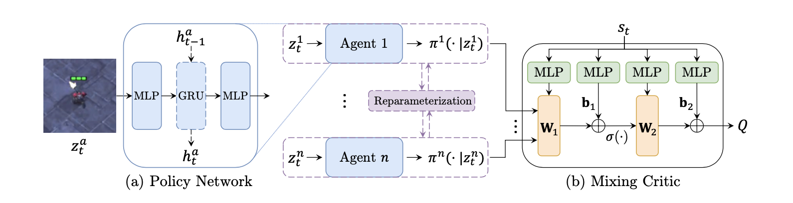

# Multi-Agent-RL
Paper list of multi-agent reinforcement learning (MARL)

- [Multi-Agent-RL](#multi-agent-rl)
  - [Credit Assignment Problem in MARL](#credit-assignment-problem-in-marl)
    - [Explicit assignment](#explicit-assignment)
      - [Reward Assignment](#reward-assignment)
        - [Distributed Welfare Games](#distributed-welfare-games)
        - [Difference Rewards Policy Gradients](#difference-rewards-policy-gradients)
        - [Social Influence as Intrinsic Motivation](#social-influence-as-intrinsic-motivation)
        - [Incentivizing Collaboration in a Competition](#incentivizing-collaboration-in-a-competition)
        - [Social Diversity and Social Preferences in Mixed-Motive Reinforcement Learning](#social-diversity-and-social-preferences-in-mixed-motive-reinforcement-learning)
        - [Inducing Cooperation through Reward Reshaping based on Peer Evaluations](#inducing-cooperation-through-reward-reshaping-based-on-peer-evaluations)
        - [Gifting in Multi-Agent Reinforcement Learning](#gifting-in-multi-agent-reinforcement-learning)
        - [Cooperation and Reputation Dynamics with Reinforcement Learning](#cooperation-and-reputation-dynamics-with-reinforcement-learning)
      - [Value Assignment](#value-assignment)
        - [MADDPG: Multi-Agent Actor-Critic for Mixed Cooperative-Competitive Environments](#maddpg-multi-agent-actor-critic-for-mixed-cooperative-competitive-environments)
        - [COMA: Counterfactual Multi-Agent Policy Gradients](#coma-counterfactual-multi-agent-policy-gradients)
        - [Shapley Q-value: Shapley Q-value: A Local Reward Approach to Solve Global Reward Games](#shapley-q-value-shapley-q-value-a-local-reward-approach-to-solve-global-reward-games)
        - [CPGs: Causal Policy Gradients](#cpgs-causal-policy-gradients)
        - [Shapley Counterfactual Credits for Multi-Agent Reinforcement Learning](#shapley-counterfactual-credits-for-multi-agent-reinforcement-learning)
    - [Learning assignment](#learning-assignment)
      - [Value Decomposition](#value-decomposition)
        - [VDN: Value-Decomposition Networks For Cooperative Multi-Agent Learning](#vdn-value-decomposition-networks-for-cooperative-multi-agent-learning)
        - [QMIX: Monotonic Value Function Factorisation for Deep Multi-Agent Reinforcement Learning](#qmix-monotonic-value-function-factorisation-for-deep-multi-agent-reinforcement-learning)
        - [DOP: Off-Policy Multi-Agent Decomposed Policy Gradients](#dop-off-policy-multi-agent-decomposed-policy-gradients)
        - [LICA: Learning Implicit Credit Assignment for Cooperative Multi-Agent Reinforcement Learning](#lica-learning-implicit-credit-assignment-for-cooperative-multi-agent-reinforcement-learning)
        - [CollaQ: Multi-agent Collaboration via Reward Attribution Decomposition](#collaq-multi-agent-collaboration-via-reward-attribution-decomposition)
      - [Reward shaping](#reward-shaping)
        - [On Learning Intrinsic Rewards for Policy Gradient Methods](#on-learning-intrinsic-rewards-for-policy-gradient-methods)
        - [LIIR: Learning Individual Intrinsic Reward in Multi-Agent Reinforcement Learning](#liir-learning-individual-intrinsic-reward-in-multi-agent-reinforcement-learning)
        - [Adaptive Mechanism Design: Learning to Promote Cooperation](#adaptive-mechanism-design-learning-to-promote-cooperation)
        - [Learning to Incentivize Other Learning Agents](#learning-to-incentivize-other-learning-agents)
        - [Learning to Share in Multi-Agent Reinforcement Learning](#learning-to-share-in-multi-agent-reinforcement-learning)
        - [Coordinating the Crowd: Inducing Desirable Equilibria in Non-Cooperative Systems](#coordinating-the-crowd-inducing-desirable-equilibria-in-non-cooperative-systems)
        - [D3C: Reducing the Price of Anarchy in Multi-Agent Learning](#d3c-reducing-the-price-of-anarchy-in-multi-agent-learning)
  - [Information Sharing in MARL](#information-sharing-in-marl)
    - [Central Critic](#central-critic)
      - [Lower level sharing](#lower-level-sharing)
        - [MADDPG: Multi-Agent Actor-Critic for Mixed Cooperative-Competitive Environments](#maddpg-multi-agent-actor-critic-for-mixed-cooperative-competitive-environments-1)
        - [BiCNet: Multiagent Bidirectionally-Coordinated Nets](#bicnet-multiagent-bidirectionally-coordinated-nets)
      - [Higher level sharing](#higher-level-sharing)
    - [Local Critic](#local-critic)
      - [Lower level sharing](#lower-level-sharing-1)
      - [Higher level sharing](#higher-level-sharing-1)
  - [Planning in MARL](#planning-in-marl)
    - [Explicit planning](#explicit-planning)
    - [Implicit planning](#implicit-planning)
  - [Hierarchical Reinforcement Learning](#hierarchical-reinforcement-learning)
    - [Goal-conditioned HRL](#goal-conditioned-hrl)
      - [Feudal Reinforcement Learning](#feudal-reinforcement-learning)
      - [HAM](#ham)
      - [UVFA](#uvfa)
      - [FuN](#fun)
      - [h-DQN](#h-dqn)
      - [HER](#her)
      - [HIRO](#hiro)
      - [Language as an Abstraction](#language-as-an-abstraction)

## Credit Assignment Problem in MARL
In the cooperative MARL setting, either global reward or individual reward is coupled with other agents. The Credit Assignment Problem is to assign proper reward or value to agents, so agents can make cooperative decisions individually.
1. Difference reward
   1. [Optimal Payoff Functions for Members of Collectives. 2001](http://www.eecs.harvard.edu/cs286r/courses/spring06/papers/wolptumer_optimalPay01.pdf)
      1. Aristocrat Utility:
         1. marginal contribution of agent (coalition)
      2. Wonderful Life Utility: 
         1. counterfactual baseline

### Explicit assignment
Explicitly calculate the contribution of single agent

#### Reward Assignment
Global reward -> (explicit calculation) -> local reward 
##### Distributed Welfare Games
   1. rules of assignment
      1. Budget balance
      2. Informational dependencies
      3. Induced nash equilibrium
   2. assignments
      1. Equally Shared
      2. Marginal Contribution
      3. Shapley Value
      4. The Weighted Shapley Value
##### Difference Rewards Policy Gradients
   1. global reward setting
      1. counterfactual reward
      2. difference return

##### Social Influence as Intrinsic Motivation
   1. individual reward design

      1. extrinsic reward
      2. social influence
         1. measure the cause influence between two agents
         2. KL divergence of policy of one agent with/o anther agent

##### Incentivizing Collaboration in a Competition
   1. individual reward design (local social welfare)

      1. this utility induce NE that maximize social welfare.
         1. potential function is the global social welfare

##### Social Diversity and Social Preferences in Mixed-Motive Reinforcement Learning
   1. individual reward design
      1. consider willingness of cooperation
      2. social value orientation

##### Inducing Cooperation through Reward Reshaping based on Peer Evaluations
   1. individual reward design
      1. peer Evaluation: a quantification of the effect of the joint actions on agent 𝑘’s expected reward 
      2. evaluation form others
      3. final reward

##### Gifting in Multi-Agent Reinforcement Learning
   1. individual reward design
      1. zero-sum: give by accumulated reward
      2. fixed budget: given fixed at the start 
      3. Replenishable Budget: accumulated, proportional to received reward

##### Cooperation and Reputation Dynamics with Reinforcement Learning
   1. individual reward design
   
      1. 𝑈 is their payoff in a particular encounter,
      2. 𝑆 refers to the payoff they would get facing themselves

#### Value Assignment
Global Q value -> (explicit calculation) -> local Q value
##### MADDPG: Multi-Agent Actor-Critic for Mixed Cooperative-Competitive Environments
   1. use global Q value
##### COMA: Counterfactual Multi-Agent Policy Gradients
   1. minus a counterfactual baseline
   2. COMA:
##### Shapley Q-value: Shapley Q-value: A Local Reward Approach to Solve Global Reward Games
   1. use shapley value to calculate assignment

##### CPGs: Causal Policy Gradients
   1. Multi-objective MDP
      1. consider causal graph between actions and objectives
      2. causal baseline

##### Shapley Counterfactual Credits for Multi-Agent Reinforcement Learning
   1. counterfactual baseline (using default action)
  
   2. sample approximation 

### Learning assignment

#### Value Decomposition
Global Q value -> (learning decomposition) -> Local Q value
IGM: individual-global-maximization

##### VDN: Value-Decomposition Networks For Cooperative Multi-Agent Learning
   1. Value decomposition:

##### QMIX: Monotonic Value Function Factorisation for Deep Multi-Agent Reinforcement Learning
   1. Value decomposition:

##### DOP: Off-Policy Multi-Agent Decomposed Policy Gradients
   1. Value decomposition + policy gradient

##### LICA: Learning Implicit Credit Assignment for Cooperative Multi-Agent Reinforcement Learning
   1. Value decomposition + policy gradient

##### CollaQ: Multi-agent Collaboration via Reward Attribution Decomposition
   1. learning value decomposition by taylor approximation of optimal reward

   2. approximate two terms directly

#### Reward shaping
Shaping individual reward -> maximize real env-reward
Learning shaping strategy through optimization (bi-level, black-box, evolutionary,...)
##### On Learning Intrinsic Rewards for Policy Gradient Methods
   1. optimal reward
      1. reward function maximizing extrinsic environment reward
   2. Gradient-based learning
      1. use total reward to update policy parameters:

      1. update Intrinsic reward use updated policy parameters 
    
         1. extrinsic reward policy gradient
         2. chain rules + approximating second terms

##### LIIR: Learning Individual Intrinsic Reward in Multi-Agent Reinforcement Learning
   1. adopt intrinsic reward in multi-agent setting (global env reward)
      1. maximize total env reward through individual intrinsic reward-based policy
   2. Gradient
      1. update policy using prox reward (in + ex)
      2. update intrinsic reward
         1. first term
         2. second term
##### Adaptive Mechanism Design: Learning to Promote Cooperation
   1. similar as LIIR

##### Learning to Incentivize Other Learning Agents
   1. intrinsic reward comes from other agents (has individual env reward)
      1. not budget balance

   2. gradient
      1. update individual policy

      2. update intrinsic (incentive) reward:
         1. maximize individual env reward: (not budget balance)
   
         1. the same as LIIR

##### Learning to Share in Multi-Agent Reinforcement Learning
   1. intrinsic reward comes from other agents (has individual env reward)
      1. generate proportion of assignment reward $w_{ji}$
      2.  budget balance
   2. gradient
      1. bi-level learning
         1. update policy based on assigned reward
         2. update weight generator

##### Coordinating the Crowd: Inducing Desirable Equilibria in Non-Cooperative Systems
   1. intrinsic reward

      1. treat agent learning process with intrinsic reward as black-box
      2. use bayesian optimization to optimize intrinsic reward
          
         1. different with LIIR, with penalty terms

##### D3C: Reducing the Price of Anarchy in Multi-Agent Learning
   1. intrinsic reward

      1. f': linear combination of reward from other agents
      2. minimize the divergence of assignment matrix
   1. objective
      1. Local Price of Anarchy
      2. approximating its upper bound

## Information Sharing in MARL

### Central Critic

#### Lower level sharing

##### MADDPG: Multi-Agent Actor-Critic for Mixed Cooperative-Competitive Environments
1. adopt fully connected neural network to process all information
   
##### BiCNet: Multiagent Bidirectionally-Coordinated Nets
Emergence of Human-level Coordination in Learning to Play StarCraft Combat Games
1. adopt 

#### Higher level sharing

### Local Critic

#### Lower level sharing

#### Higher level sharing

## Planning in MARL

### Explicit planning

### Implicit planning

## Hierarchical Reinforcement Learning
### Goal-conditioned HRL
#### Feudal Reinforcement Learning
1. <b>Feudal Reinforcement Learning(1992)</b>
   - **Reward Hidding:**  Managers must reward sub-managers for doing their bidding whether or not this satisfies the commands of the super-managers
   - **Information Hidding:** Managers only need to know the state of the system at the granularity of their own choices of tasks
  {:height="100px" width="400px"}
2. <b>Reinforcement Learning with Hierarchies of Machines(1998)</b>
   - **Motivation:** (a) the policies learning process are constrained by hierarchies of partially specified machines(reduce search space). (b)  knowledge can be transferred across problems and in which component solutionscan be recombined to solve larger and more complicated problems
   
3. <b>Universal Value Function Approximators(2015, David Silver)</b>
   -**Universal value function** The pseudo-discount γg takes the double role of statedependent discounting, and of soft termination, in the sense that γ(s) = 0 if and only if s is a terminal state according to goal g 
   $$V_{g, \pi}(s):=\mathbb{E}\left[\sum_{t=0}^{\infty} R_{g}\left(s_{t+1}, a_{t}, s_{t}\right) \prod_{k=0}^{t} \gamma_{g}\left(s_{k}\right) \mid s_{0}=s\right]$$
   $$Q_{g, \pi}(s, a):=\mathbb{E}_{s^{\prime}}\left[R_{g}\left(s, a, s^{\prime}\right)+\gamma_{g}\left(s^{\prime}\right) \cdot V_{g, \pi}\left(s^{\prime}\right)\right]$$
   -**Function Approximation Architecture**

   
   
4. <b>FeUdal Networks for Hierarchical Reinforcement Learning(2017, David Silver)</b>
   - **Motivation** (1) long timescale credit assignment (2) encourage the emergence of sub-policies associated with different goals set by manager (3) end-to-end HRL
   
   - **Goal Embedding** The manager internally computes a latent state representation $s_t$ and output a goal vector $g_t$ 
   - **Manager Learning**
   $$z_{t}=f^{\text {percept }}\left(x_{t}\right)$$
$$s_{t}=f^{\text {Mspace }}\left(z_{t}\right)$$
$$h_{t}^{M}, \hat{g}_{t}=f^{M r n n}\left(s_{t}, h_{t-1}^{M}\right) ; g_{t}=\hat{g}_{t} /\left\|\hat{g}_{t}\right\| ;$$
$$h^{W}, U_{t}=f^{W r n n}\left(z_{t}, h_{t-1}^{W}\right)$$
$$\pi_{t}=\operatorname{SoftMax}\left(U_{t} w_{t}\right)$$
   - **Manager Learning**
   $$\nabla_{\theta} \pi_{t}^{T P}=\mathbb{E}\left[\left(R_{t}-V\left(s_{t}\right)\right) \nabla_{\theta} \log p\left(s_{t+c} \mid s_{t}, \mu\left(s_{t}, \theta\right)\right)\right]$$
   $$p\left(s_{t+c} \mid s_{t}, g_{t}\right) \propto e^{d_{\cos }\left(s_{t+c}-s_{t}, g_{t}\right)}$$
   $$\nabla_{\theta} \pi_{t}^{T P}=\mathbb{E}\left[\left(R_{t}-V\left(s_{t}\right)\right) \nabla_{\theta} \log p\left(s_{t+c} \mid s_{t}, \mu\left(s_{t}, \theta\right)\right)\right]$$
   - **Intrisic Reward** In practice we take a softer approach by adding an intrinsic reward for following the goals, but retaining the environment reward as well
   $$r_{t}^{I}=1 / c \sum_{i=1}^{c} d_{\cos }\left(s_{t}-s_{t-i}, g_{t-i}\right)$$
   - **Worker Learning**
   $$\nabla \pi_{t}=A_{t}^{D} \nabla_{\theta} \log \pi\left(a_{t} \mid x_{t} ; \theta\right)$$
   $$A_{t}^{D}=\left(R_{t}+\alpha R_{t}^{I}-V_{t}^{D}\left(x_{t} ; \theta\right)\right)$$
   
5. <b>Hierarchical Deep Reinforcement Learning : Integrating Temporal Abstraction andIntrinsic Motivation(2017)</b>
   - **Problem**: sparse reward resulting in insufficient exploration
   - **Motivation**: intrinsically motivated agents to explore new behavior for their own sake rather than directly solve the extenal goals
   - **Method**: hierarchical reinforcement learning with intrinsic reward
   
   
   - Meta-controller: The objective of meta-controller is to maximize the extrinsic reward received $F_{t}=\sum_{t^{\prime}=t}^{\infty} \gamma^{t^{\prime}-t} f_{t^{\prime}}$ from environment and the state-action value function is:
   $Q_{2}^{*}(s, g)=\max _{\pi_{g}} \mathrm{E}\left[\sum_{t^{\prime}=t}^{t+N} f_{t^{\prime}}+\gamma \max _{g^{\prime}} Q_{2}^{*}\left(s_{t+N}, g^{\prime}\right) \mid s_{t}=s, g_{t}=g, \pi_{g}\right]$
   - Controller: The objective of controller is to maximize the intrinsic reward $R_{t}(g)=\sum_{t^{\prime}=t}^{\infty} \gamma^{t^{\prime}-t} r_{t^{\prime}}(g)$ and the state-action value function is:
   $\begin{aligned} Q_{1}^{*}(s, a ; g) &=\max _{\pi_{a g}} \mathrm{E}\left[\sum_{t^{\prime}=t}^{\infty} \gamma^{t^{\prime}-t} r_{t^{\prime}} \mid s_{t}=s, a_{t}=a, g_{t}=g, \pi_{a g}\right] \\ &=\max _{\pi_{a g}} \mathrm{E}\left[r_{t}+\gamma \max _{a_{t+1}} Q_{1}^{*}\left(s_{t+1}, a_{t+1} ; g\right) \mid s_{t}=s, a_{t}=a, g_{t}=g, \pi_{a g}\right] \end{aligned}$
   
6. <b>Hindsight Experience Replay</b>
   -**Motivation** (1)The pivotal idea behind HER is to replay each episode with a **different** goal than the one the agent was trying to achieve, e.g. one of the goals which was achieved in the episode.
   
7. <b>Data-Efficient Hierarchical Reinforcement Learning</b>
   - **Challenge** Non-stationary off-policy training between high-level controller and low-leverl controller
   - **Low-level reward**
   $$r\left(s_{t}, g_{t}, a_{t}, s_{t+1}\right)=-\left\|s_{t}+g_{t}-s_{t+1}\right\|_{2}$$
   - **Off-Policy Corrections for Higher-Level Training** Fixed low-level transition, re-label a high-level goal $\tilde{g}_{t}$
   $$\log \mu^{l o}\left(a_{t: t+c-1} \mid s_{t: t+c-1}, \tilde{g}_{t: t+c-1}\right) \propto-\frac{1}{2} \sum_{i=t}^{t+c-1}\left\|a_{i}-\mu^{l o}\left(s_{i}, \tilde{g}_{i}\right)\right\|_{2}^{2}+\mathrm{const}$$

### Skill(option)-selected HRL
1. <b>Between MDPs and semi-MDPs: A framework for temporal abstraction in reinforcement learning(Sutton, 1999)</b>
   - **Motivation**Human decision making routinely involves choice among temporally extended courses of action over a broad range of time scales
   - **Semi-MDP(option-to-option)**
   
   
2. <b>The option-critic framework</b>
   - **Motivation** Internal policies and the termination conditions of options, in tandem with the policy over options, and without the need to provide any additional rewards or subgoals
   - **Architecture**
   
   - **option-value function**
   $$Q_{\Omega}(s, \omega)=\sum_{a} \pi_{\omega, \theta}(a \mid s) Q_{U}(s, \omega, a)$$
   - **state-action value function**
   $$Q_{U}(s, \omega, a)=r(s, a)+\gamma \sum_{s^{\prime}} \mathrm{P}\left(s^{\prime} \mid s, a\right) U\left(\omega, s^{\prime}\right)$$
   $$U\left(\omega, s^{\prime}\right)=\left(1-\beta_{\omega, \vartheta}\left(s^{\prime}\right)\right) Q_{\Omega}\left(s^{\prime}, \omega\right)+\beta_{\omega, \vartheta}\left(s^{\prime}\right) V_{\Omega}\left(s^{\prime}\right)$$
   $$\mathrm{P}\left(s_{t+1}, \omega_{t+1} \mid s_{t}, \omega_{t}\right)=\sum_{a} \pi_{\omega_{t}, \theta}\left(a \mid s_{t}\right) \mathrm{P}\left(s_{t+1} \mid s_{t}, a\right)($$
   $$\left.\left(1-\beta_{\omega_{t}, \vartheta}\left(s_{t+1}\right)\right) \mathbf{1}_{\omega_{t}=\omega_{t+1}}+\beta_{\omega_{t}, \vartheta}\left(s_{t+1}\right) \pi_{\Omega}\left(\omega_{t+1} \mid s_{t+1}\right)\right)$$
3. <b>Learning to Interrupt: A Hierarchical Deep Reinforcement Learning Framework for Efficient Exploration</b>
   - **state-value function**
   
   
4. <b>STOCHASTIC NEURAL NETWORKS FOR HIERARCHICAL REINFORCEMENT LEARNING(2017, Pieter Abbeel)</b>
   - **Motivation** Using Stochastic Neural Networks combined with an information-theoretic regularizer to pre-train a span of skills

